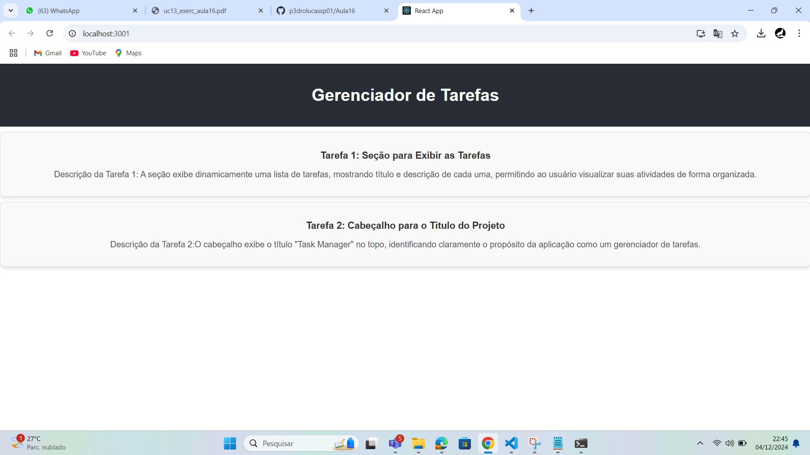

# Exercício React Elements JSX - Task Manager

## Descrição

Este exercício consiste em criar um gerenciador de tarefas simples utilizando React. Durante o desenvolvimento, foram aplicados conceitos como criação de componentes, uso de JSX, React Fragments e validação de props com `PropTypes`.

## O que foi feito

### 1. Configuração do Projeto
- Criado o ambiente React utilizando o `create-react-app`:
  ```bash
  npx create-react-app task-manager
  cd task-manager
  ```
- Instalado o pacote `prop-types` para validação de propriedades:
  ```bash
  npm install prop-types
  ```
- Inicializado o projeto com:
  ```bash
  npm start
  ```

### 2. Estruturação do Projeto
- No arquivo `src/App.js`, removi o conteúdo padrão e criei dois containers principais:
  - **Cabeçalho:** Exibe o título do projeto, utilizando o componente `Header`.
  - **Seção de Tarefas:** Mostra a lista de tarefas, gerenciada pelo componente `TaskContainer`.

#### Código Final do `App.js`:
```jsx
import React from 'react';
import Header from './components/Header';
import TaskContainer from './components/TaskContainer';

function App() {
  return (
    <div className="App">
      <Header />
      <TaskContainer />
    </div>
  );
}

export default App;
```

### 3. Componente Header
- Criado em `src/components/Header.js`, responsável por exibir o título do projeto.

```jsx
import React from 'react';

function Header() {
  return (
    <header>
      <h1>Task Manager</h1>
    </header>
  );
}

export default Header;
```

### 4. Componente TaskContainer
- Criado em `src/components/TaskContainer.jsx` para gerenciar a lista de tarefas.
- Utilizei `React.Fragment` para envolver elementos sem adicionar um nó extra no DOM.
- Inicialmente, a lista de tarefas foi representada como elementos JSX diretamente no componente.

```jsx
import React from 'react';

function TaskContainer() {
  return (
    <React.Fragment>
      <div className="task">
        <h3>Tarefa 1</h3>
        <p>Descrição da Tarefa 1</p>
      </div>
      <div className="task">
        <h3>Tarefa 2</h3>
        <p>Descrição da Tarefa 2</p>
      </div>
    </React.Fragment>
  );
}

export default TaskContainer;
```

### 5. Componente Task
- Criado em `src/components/Task.js` para renderizar dinamicamente o título e a descrição de cada tarefa.
- Utilizei `PropTypes` para validar os dados passados como propriedades.

```jsx
import React from 'react';
import PropTypes from 'prop-types';

function Task({ title, description }) {
  return (
    <div className="task">
      <h3>{title}</h3>
      <p>{description}</p>
    </div>
  );
}

Task.propTypes = {
  title: PropTypes.string.isRequired,
  description: PropTypes.string.isRequired,
};

export default Task;
```

### 6. Atualização do TaskContainer
- Modifiquei o `TaskContainer` para usar o componente `Task`.
- Adicionei uma lista de tarefas fictícias e utilizei o método `map` para renderizar cada tarefa.

```jsx
import React from 'react';
import Task from './Task';

function TaskContainer() {
  const tasks = [
    { id: 1, title: 'Tarefa 1', description: 'Descrição da Tarefa 1' },
    { id: 2, title: 'Tarefa 2', description: 'Descrição da Tarefa 2' },
  ];

  return (
    <div>
      {tasks.map((task) => (
        <Task key={task.id} title={task.title} description={task.description} />
      ))}
    </div>
  );
}

export default TaskContainer;
```

## Execução do Projeto
Para rodar o projeto, basta executar o comando:
```bash
npm start
```
